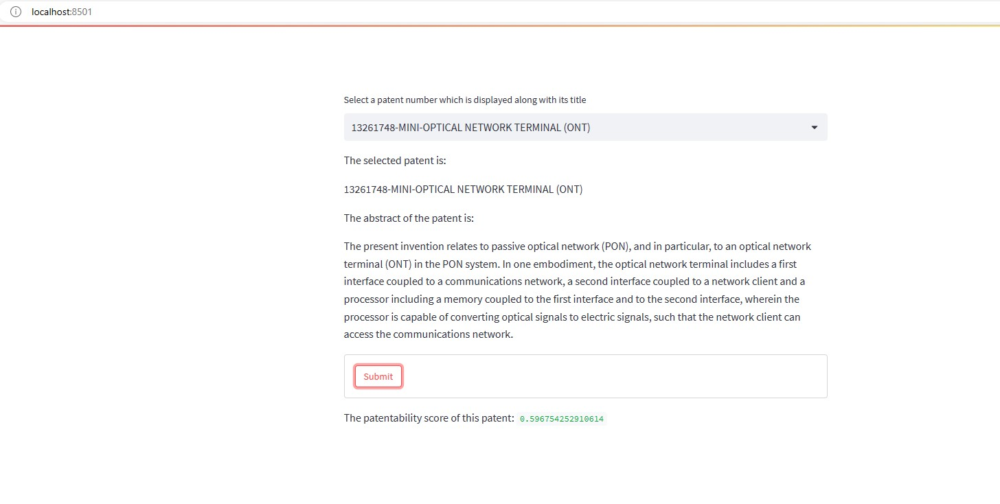
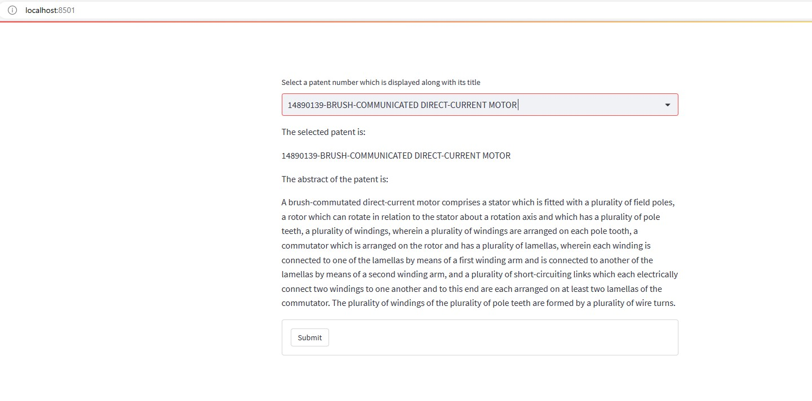
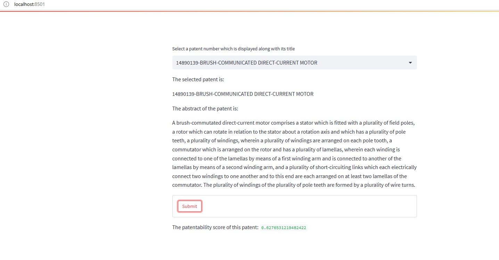

[https://huggingface.co/spaces/arpachat/sentiment-analysis](https://huggingface.co/spaces/arpachat/Patentability-Score) 
https://huggingface.co/arpachat/model-patent-score

---
title: Sentiment Analysis
emoji: 🐢
colorFrom: green
colorTo: purple
sdk: streamlit
sdk_version: 1.17.0
app_file: app.py
pinned: false
---

<h2> New York University Tandon School of Engineering   Computer Science and Engineering   CS-GY 6613 Project: FineTuning-Language-Models </h2>
<h4>Name: Arpan Chatterjee Email: ac9839@nyu.edu ID Number: N14082602</h4>

The app is not running in hugging face due to a 410 error, which I couldn't fix.

The app has run succesfully in my local machine using "streamlit run app.py". Note that, the model folder couldn't be uploaded to GitHub as the file size were over GitHub's allowed size. The model folder has been uploaded to HuggingFace Models page(link provided above). This directory should be in the same directory as app.py and named 'model-patent-score'. After this we can run streamlit application app.py using the command given in quotes above.

I am providing screenshots of the running app below

