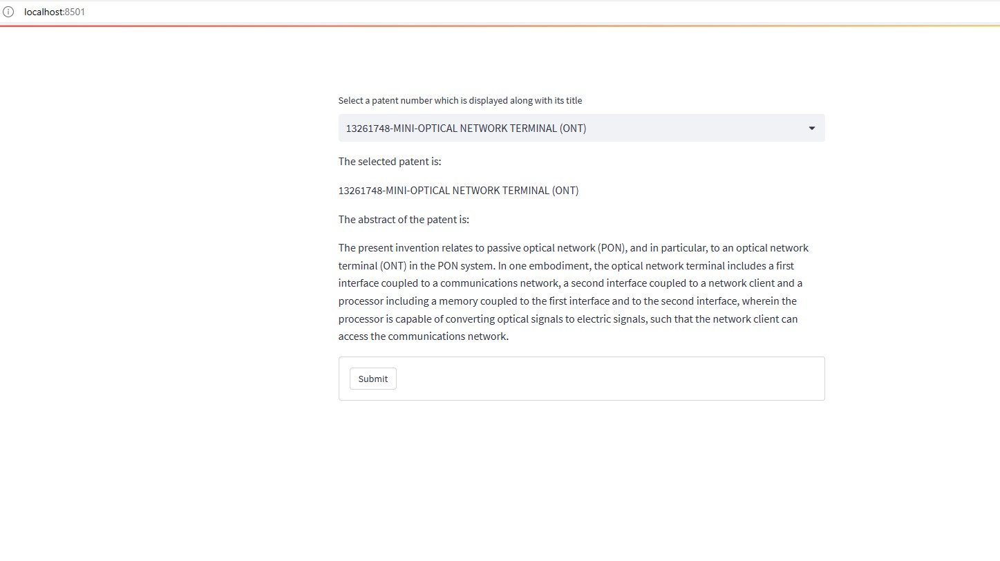

# Patentability Score
 

Landing Page:

https://sites.google.com/view/patent-score-checker/home

App Link:

[https://huggingface.co/spaces/arpachat/sentiment-analysis](https://huggingface.co/spaces/arpachat/Patentability-Score) 

Model Link:

https://huggingface.co/arpachat/model-patent-score

 

To run this application locally, follow the steps discussed below:-

<ol>
<li>Pull this directory to your local repository.</li> 
  
<i>git pull https://github.com/dungarpan/AI-Project-FineTuning-Language-Models.git</i>
 
<li>Create a virtual environment and install all the dependencies mentioned inside the requirements.txt file</li> 
  
<i>pip install -r requirements.txt</i>
 
<li>Note that, the model folder couldn't be uploaded to GitHub as the file size were over GitHub's allowed size. The model folder has been uploaded to HuggingFace Models page(link provided above). This directory should be downloaded and put in the same directory as app.py and named 'model-patent-score'.</li> 
<li>After this we can run streamlit application app.py using the command:</li> 

<i>streamlit run app.py</i>
 
</ol> 

I am providing screenshots of the running app below

